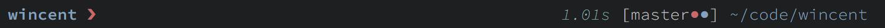
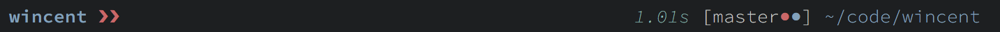
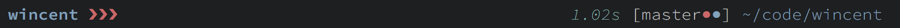
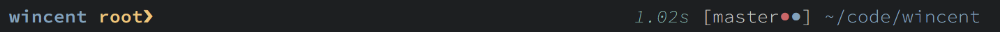
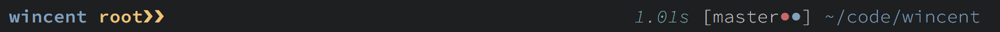
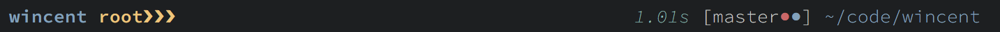
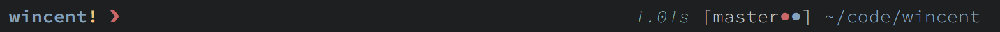
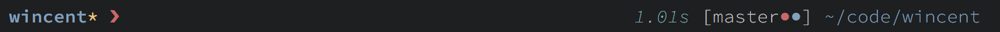

# winline

Asyncify version of Greg Hurrell's [zsh prompt](https://github.com/wincent/wincent/blob/master/aspects/dotfiles/files/.zshrc)

## Feature

> taken from https://github.com/wincent/wincent/blob/master/README.md#prompt



Visible here are:

- Concise left-hand prompt consisting of:
  -   Last component of current directory (abbreviates `$HOME` to `~` if possible).
  -   Prompt marker, `❯`, the "[HEAVY RIGHT-POINTING ANGLE QUOTATION MARK ORNAMENT](https://codepoints.net/U+276F)" (that's `\u276f`, or `e2 9d af` in UTF-8).
- Extended right-hand size prompt which auto-hides when necessary to make room for long commands and contains:
  - Duration of previous command in adaptive units (seconds, minutes, hours, days, depending on duration).
  - An async git prompt consists of:
    - Current version control branch name.
    - Current version control worktree status using colors that match those used in `git status`:
      -   Green dot indicates staged changes.
      -   Red dot indicates unstaged changes.
      -   Blue dot indicates untracked files.
  - Full version of current working directory (again, abbreviating `$HOME` to `~`).


Nested shells are indicated with additional prompt characters. For example, one nested shell:



Two nested shells:



Root shells are indicated with a different color prompt character and the word "root":



Nesting within a root shell is indicated like this:



Two nested shells:



If the last command exited with a non-zero status (usually indicative of an error), a yellow exclamation is shown:



If there are background processes, a yellow asterisk is shown:



## Why

- My friends request me to extract this prompt from my dotfiles to a separate repository (￣▽￣)
- Async is great for working with large repository (ex: https://github.com/gentoo/gentoo)

## Installation

1. Clone this repository
``` sh
$ git clone https://github.com/Z5483/winline.git
```

2. Add the repository to `$fpath` in `.zshrc`
``` sh
fpath+=/path/to/winline
```

3. source either `winline.zsh` or `winline.plugin.zsh` in `.zshrc`
``` sh
. /path/to/winline.zsh

# or

. /path/to/winline.plugin.zsh
```

## Fallback

This prompt is heavily tailored to my needs so it is not very customizable
compare to other mainstream zsh prompts such as:
- https://github.com/sindresorhus/pure
- https://github.com/starship/starship
- https://github.com/romkatv/powerlevel10k

Therefore, it is highly encourage that you use either one of the above or a
different prompt if you want more granular customization or advance feature.
